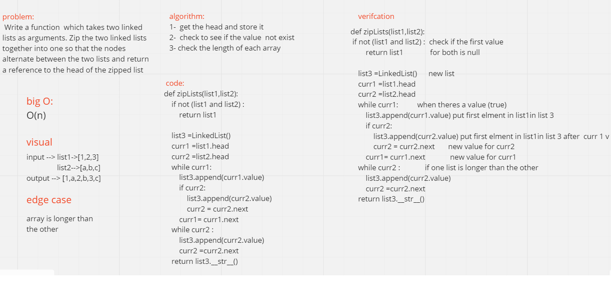

# Challenge Summary
Write a function  which takes two linked lists as arguments. Zip the two linked lists together into one so that the nodes alternate between the two lists and return a reference to the head of the zipped list

## Whiteboard Process

## Approach & Efficiency
o(n)

## Solution
input --> list1->[1,2,3]
          list2-->[a,b,c]
output --> [1,a,2,b,3,c]