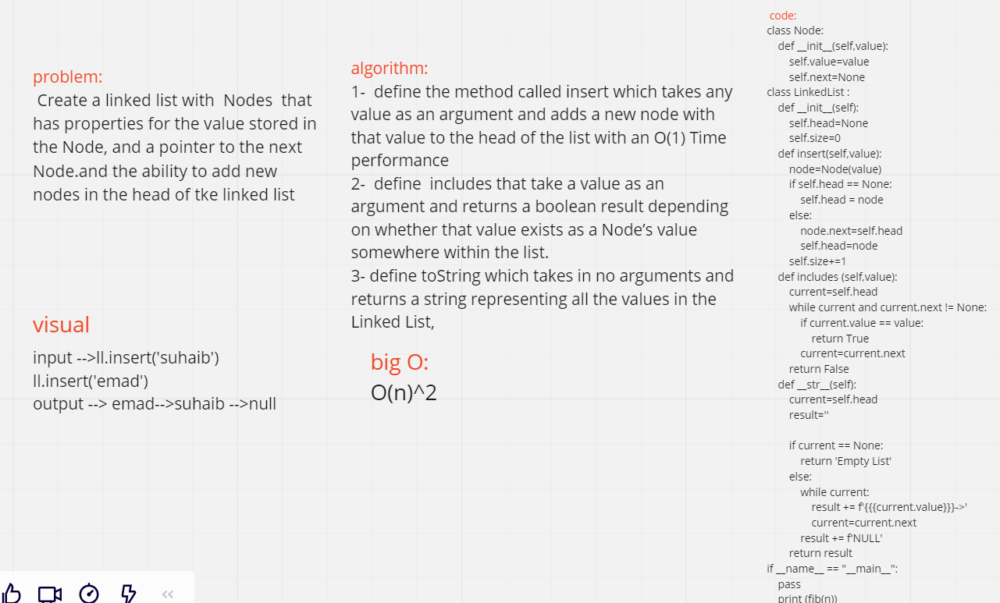

# linked list
 Create a linked list with  Nodes  that has properties for the value stored in the Node, and a pointer to the next Node.and the ability to add new nodes in the head of tke linked list 

# Whiteboard process:

# Approach & Efficiency:
1-  define the method called insert which takes any value as an argument and adds a new node with that value to the head of the list with an O(1) Time performance
2-  define  includes that take a value as an argument and returns a boolean result depending on whether that value exists as a Node’s value somewhere within the list.
3- define toString (or __str__ in Python) which takes in no arguments and returns a string representing all the values in the Linked List, formatted as:
"{ a } -> { b } -> { c } -> NULL"
