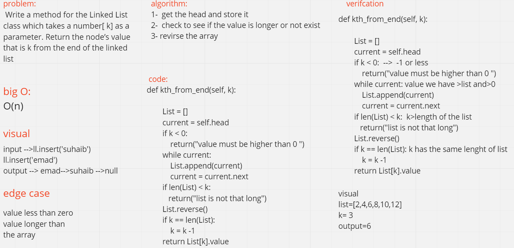

# linked list
 Write a method for the Linked List class which takes a number, k, as a parameter. Return the node’s value that is k from the end of the linked list

# Whiteboard process:

# Approach & Efficiency:
1-  define the method called ll-kth-from-end which takes any value of k and check it 
2-  after that reverse the list .

