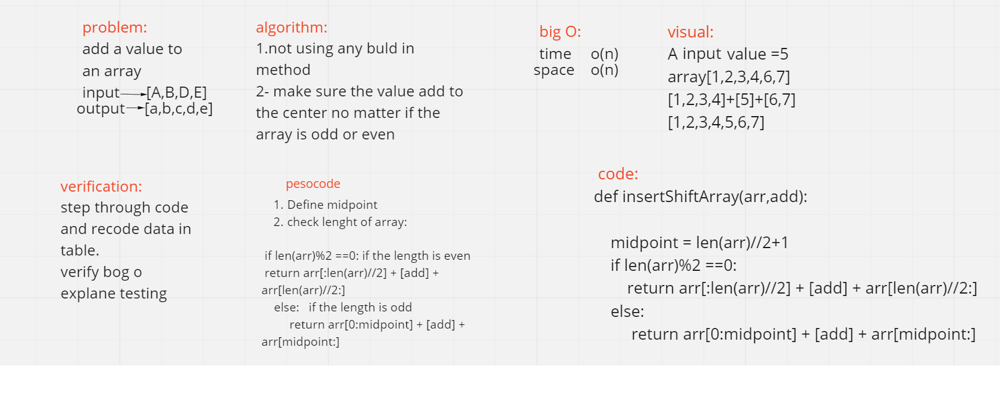

# Binary search:
- This challenge asked me to find a method to search a value inside the list.

# Whiteboard process:

# Approach & Efficiency:
- I just divided the length by 2 so i have them as 2 arrays then add the value in the center the sum the 2 arrays with the new value in the middle
