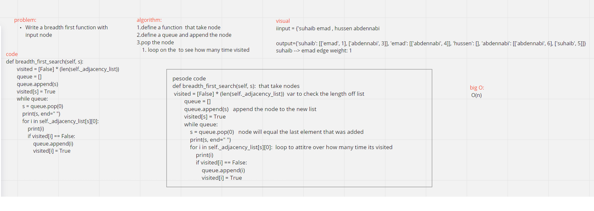

# Challenge Summary
 implement a breadth-first traversal on a graph.

# Whiteboard Process
 

# Approach & Efficiency
The approach used was Using, queues, set and traversing.

# Big O of N
Time: O(N)
Space: O(N)
