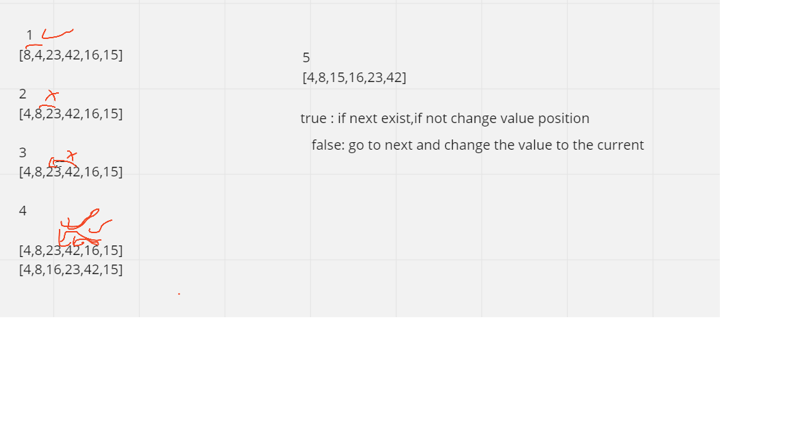

# Selection Sort
 it mean traverses the array multiple times. The traversal keeps track of the minimum value and places it in the front of the array which should be  sorted.

 ## Trace
Sample Array : [8,4,23,42,16,15]

The first element in the array is assumed to be sorted. Take the second element and store it separately in key.

Compare key with the first element. If the first element is greater than key, then key is placed in front of the first element.

If the first element is greater than key, then key is placed in front of the first element.

 Now, the first two elements are sorted.
Take the third element and compare it with the elements on the left of it. Placed it just behind the element smaller than it. If there is no element smaller than it, then place it at the beginning of the array.

 Place 1 at the beginningSimilarly, place every unsorted element at its correct position.
 Place 4 behind 1

