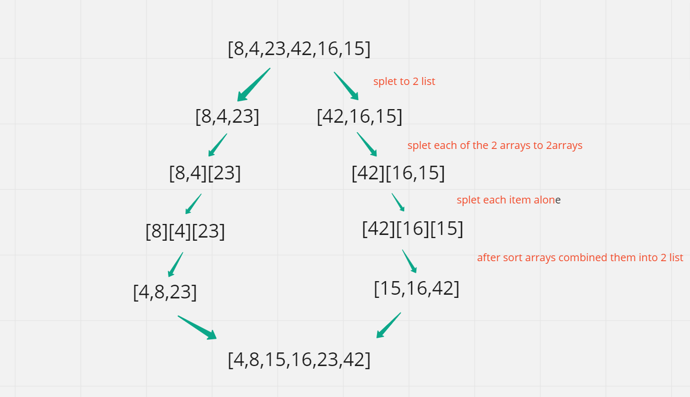

## Merge Sort

 It divides input array in two halves, The merge(arr, l, m, r) is key process that assumes that arr[l..m] and arr[m+1..r] are sorted and merges them toghter 

## trace

# time  and space 
 Time: O(n^2) Space: O(1)