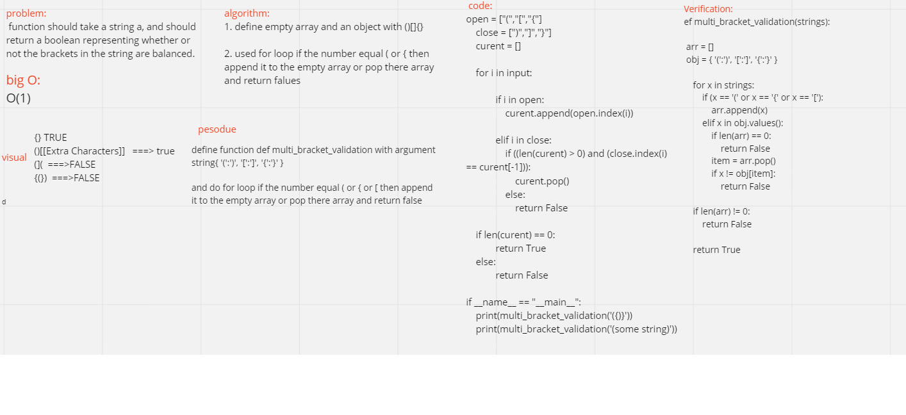

#   multi bracket
 function should take a string a, and should return a boolean representing whether or not the brackets in the string are balanced. 

# whitebored

## Approach & Efficiency
using for loop to check for ()[]{}

## API
len 