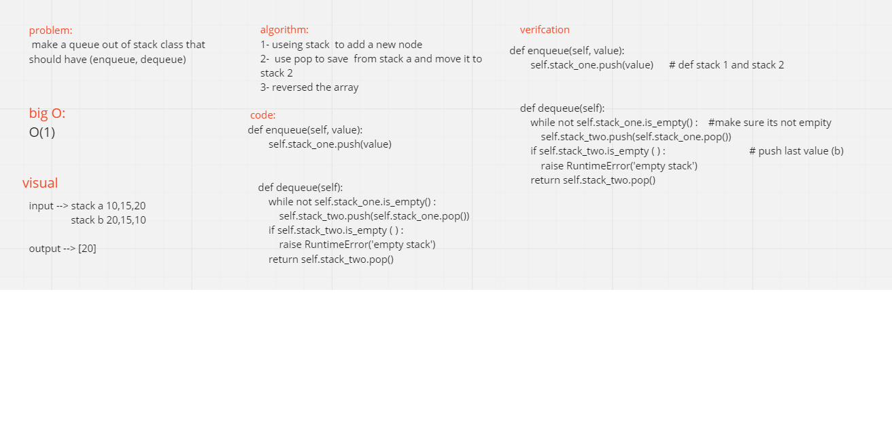

#   Queues with Stacks
make a queue out of stack class that should have (enqueue, dequeue) 

# whitebored

## Challenge
Create a brand new PseudoQueue class. Do not use an existing Queue. Instead

## Approach & Efficiency
enqueu: by using stack() method push I will add new node to the stackA.

## API
enqeueu: add a value to the end of the queue
dequeue: removes the first value in the queue
