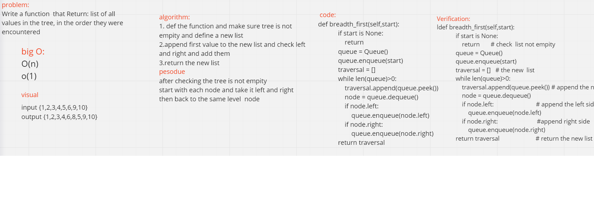

# Breadth First
function that takes a tree and returns its values as a list sorted according to breadth value.

 # Challenge
 deal with the tree as node and right and left.

# Approach and efficacy
O(N) for time O(1) for space

# Solution
