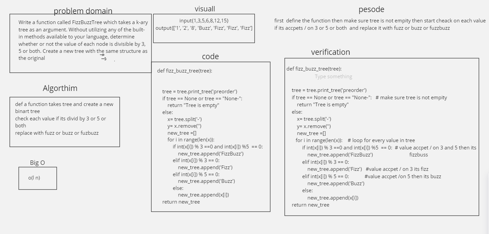

# Challenge Summary
 go through each node and check the values If the value is divisible by 3, replace the value with “Fizz” If the value is divisible by 5, replace the value with “Buzz” If the value is divisible by 3 and 5, replace the value with “FizzBuzz” If the value is not divisible by 3 or 5, simply turn the number into a String.

# Approach & Efficiency

BigO = O(n)

# Solution
