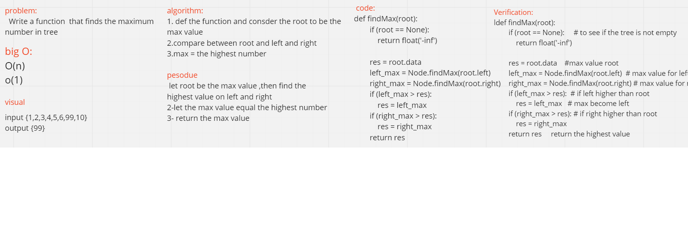

# Find Maximum Value
function that returns the maximum value from a binary tree.

# Challenge
testing .

# Approach and efficacy
O(N) for time O(1) for space

 # Solution

# api 
create  tree.

max value function

Find max value 